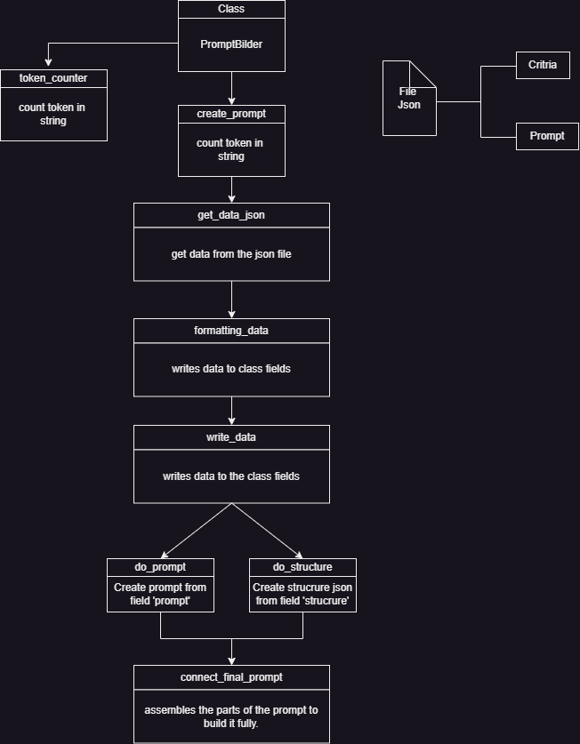

# Приклад роботи програми:

## Вихід готового промпта в консолі з файлу `criteria.json`: 

```
Please analyze the given dialogues by carefully considering the criteria I will provide. It is essential to provide accurate and specific responses. Kindly ensure that you cover all the necessary details and do not overlook any important points. Here are the essential parameters to analyze:
theme - a short description of the dialog, for a quick understanding of what is being talked about
tonality - reflects the emotional coloring of communication between participants - positive/negative/neutrally
classification - which of the following categories the call belongs to, based on its content, purpose or other characteristics - finances/maintenance/new connection/reconnection
Give the answer in the format of JSON, with a layered structure: 
{
  "theme": ""
  "tonality": ""
  "classification": ""
}
```

# Структура класу

